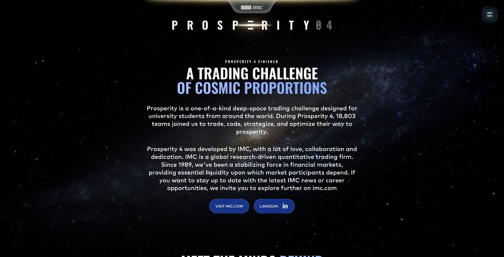
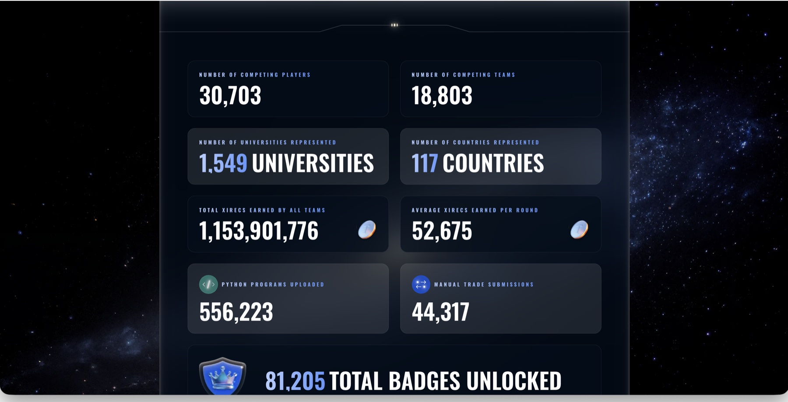
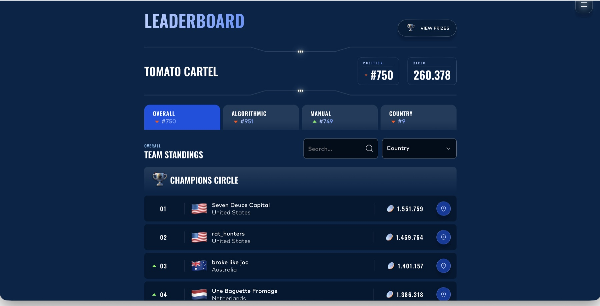
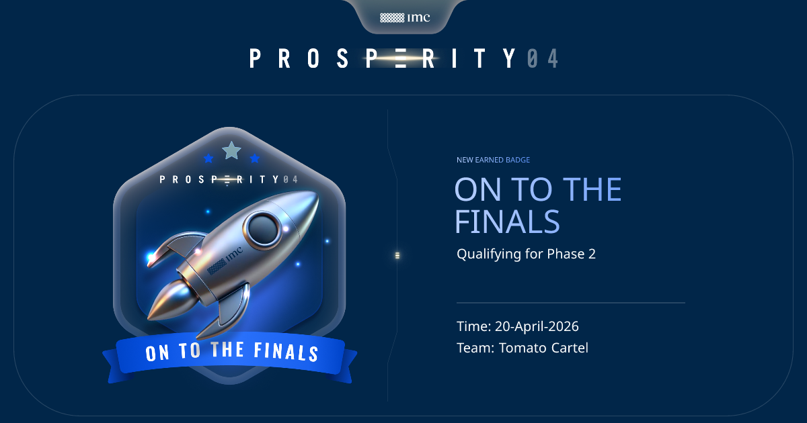

# IMC Prosperity 4 — Strategy Evaluation & Backtesting

An evidence-backed case study from IMC's five-round international trading challenge. The central problem was not finding the most complicated signal; it was deciding which results were trustworthy after spreads, transaction costs, and differences between local backtests and official runs.

> **Verified team result:** finalist · **#750 of 18,803 teams worldwide (top 4%)** · **#9 in Spain**.

## The challenge

Each round combined an algorithmic submission with a manual challenge in a simulated market. Our team needed a repeatable way to compare ideas, tune parameters, identify misleading results, and make a final trading decision under a deadline.

The scale image is a privacy-safe crop of the retained official IMC results page. Only browser chrome was removed; the published competition figures were not altered. IMC's [current Prosperity 4 page](https://prosperity.imc.com/) independently confirms 18,803 participating teams and the five-round format.

## My contribution

- Served as the backtester across all five rounds, writing Python code to evaluate the team's strategy ideas against historical CSV data.
- Built local testing, parameter-search, and risk-analysis workflows instead of treating a single backtest as ground truth.
- Compared local results with official run evidence and tested sensitivity to lookback windows, thresholds, bid-ask spreads, and transaction costs.
- Turned the analysis into a concrete recommendation about which products not to trade.

AI coding tools supported implementation and experimentation. I defined the hypotheses and test criteria, checked the evidence, interpreted failures, documented uncertainty, and translated the results into a team recommendation.

## The decision that mattered

In the final round, I analyzed signals across ten product categories. My optimizer showed that six became unprofitable once market frictions were included, so I recommended removing them from the final configuration and trading only the four categories that remained viable.

The lesson was simple: a promising signal is not enough. Execution costs, robustness across days, and the decision not to trade can matter more than model complexity.

## Verified context and result

- IMC describes Prosperity 4 as a five-round challenge with algorithmic and manual components.
- IMC's official site records **18,803 participating teams**.
- The retained final leaderboard records the team at **#750 overall**, **#951 algorithmic**, **#749 manual**, and **#9 in Spain**.

The leaderboard image is a privacy-safe crop of the original official results screen. Only browser chrome was removed; the team name, rankings, and XIREC value were not altered.

View the [finals qualification](qualified-for-finals.png), the [final leaderboard](final-leaderboard-clean.jpg), and the [full evidence brief](Daniel-Pena-IMC-Prosperity-4-Evidence-Brief.pdf).

## What this case study demonstrates

- Python-based analysis and backtesting
- Experimental design and parameter testing
- Evidence-based decision-making under uncertainty
- Transaction-cost and spread sensitivity
- Clear separation of individual contribution from team results

## Boundaries

- Rankings and competition PnL are team results from a simulated market, not individual or real-money performance.
- This repository is a concise case study, not the team's trading code or private working materials.
- The exact Round 5 uploaded file was not retained in an official result bundle, so no claim depends on reconstructing it.
